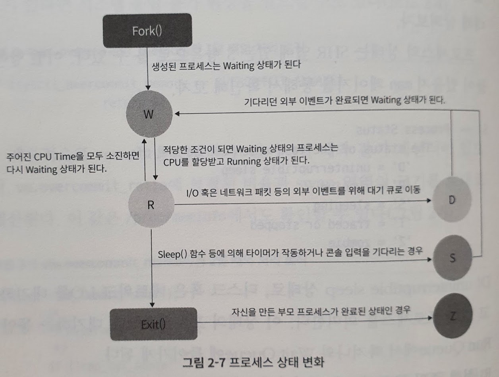
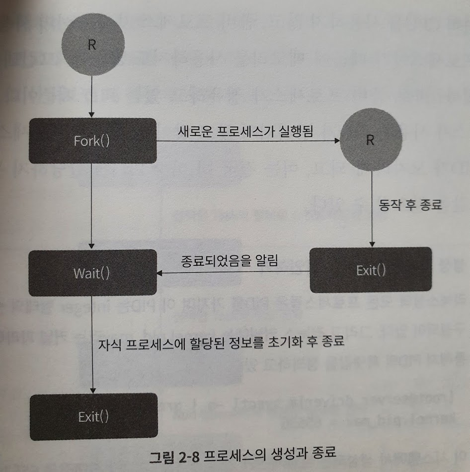
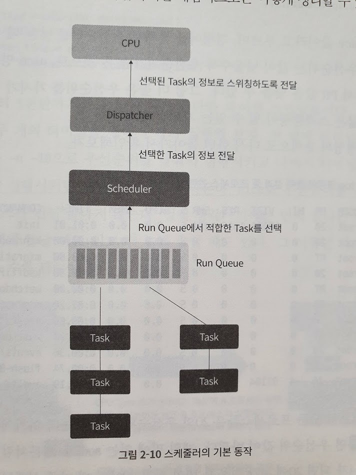
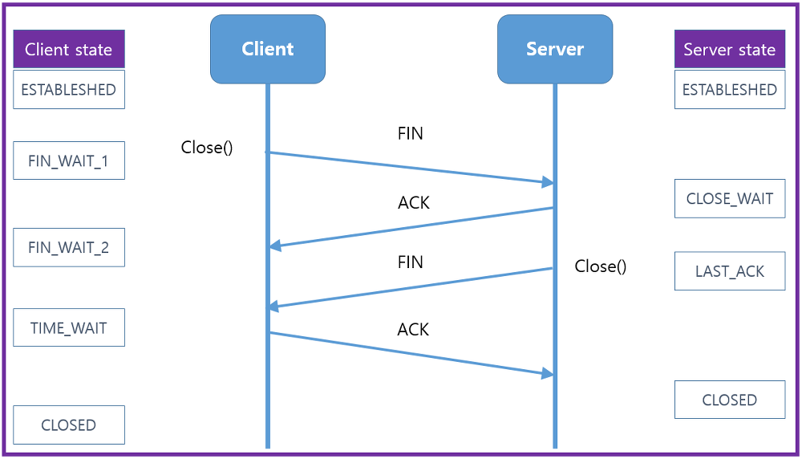

# DevOps와 SE를 위한 리눅스커널이야기

* 동일하게 리눅스 기초를 다루다보니 만화로 배우는 리눅스 시스템관리 책과 중복되는 내용이 많다. 차이점을 보면 제목대로 이 책이 좀 더 실무 운영 환경에 맞게 작성되었다.


## 공통


### 커널 파라미터 확인 

* 모든 정보는 /proc/sys 이하에서 관리
* sysctl 명령을 통해 조회 가능
  * `sysctl vm.overcommit_memory` : vm.overcommit_memory 파라미터 조회
  * `sysctl -a` : 모든 파라미터 조회

### 커널 파라미터 수정

* 임시 수정
  * `sysctl -w vm.overcommit_memory=1`
* 재부팅시 적용
  * `/etc/sysctl.conf` 수정


## 1장 시스템 구성 정보 확인하기

* 시스템의 문제 분석을 위해서는 현재 시스템의 구성 정보를 볼 줄 알아야함.


### 커널 정보 확인

* `uname -a` : 커널 버전 확인


### 하드웨어 정보 확인

* dmidecode 명령을 통해 CPU, 메모리, 시스템 등의 주요 하드웨어 정보 확인 가능. 주로 쓰는 건 bios, system, processor, memory


### CPU

* `dmidecode -t bios` : bios 정보
* `dmidecode -t system` : 제조사, 모델명 등
* `dmidecode -t processor` : cpu 정보 (소켓, 코어)
  * 소켓 : 물리적인 cpu 개수
  * 코어 : 물리적인 cpu 안의 컴퓨팅 코어 개수
* `cat /proc/cpuinfo` : cpu 정보를 보는 두 번째 방법
* `lscpu` : cpu 정보를 보는 세 번째 방법. NUMA 정보를 함께 보여줌.


### 메모리

* `dmidecode -t memory`
* memory 키워드는 크게 Physical Memory Array와 Memory Device 의 두 영역으로 나눌 수 있음
  * Physical Memory Array : 하나의 CPU 소켓에 함께 할당된 물리 메모리 그룹. NUMA라는 개념을 통해 각각의 CPU가 사용할 수 있는 로컬 메모리 개념.
  * Memory Device : 실제로 시스템에 설치된 메모리
* `dmidecode -t memory | grep -i size` 로 보면 실제로 설치된 메모리들의 크기를 확인할 수 있으며 이의 합계는 `free` 명령과 일치함. (다를 경우 메모리 인식에 문제가 있는 것)


### 디스크

* `df -h` : 파티션 (ex: `/, /data1, ...`), 디스크(ex: `/dev/sda, ...`) 등의 정보. 디스크 방식인 sda, hda, vda 등은 컨트롤러 방식에 따라 구분됨.
  * sda : SATA, SAS, SCSI 방식
  * hda : IDE 방식
  * vda : 가상 하이퍼바이저 기반의 디스크
* `smartctl -a /dev/sda` : 디스크의 물리적인 정보 (제조사, 시리얼번호, 펌웨어 정보, ...)
  * 서버의 경우 대부분 RAID 컨트롤러가 달려 있어 바로 정확한 정보를 알 수 없는 경우가 많음. (Product에 LOGICAL VOLUME 등으로 표기됨) 이 경우 RAID 컨트롤러 드라이버 정보까지 명시하면 정보를 볼 수 있음.
  * RAID 컨트롤러 드라이버는 제조사에 따라 다름 : cciss, megaraid, hpt, areca 등 (시스템에서 사용중인 RAID 컨트롤러 드라이버 정보는 lsmod 로 확인)
  * `smartctl -a /dev/sda -d cciss,0` : HP사의 cciss RAID 컨트롤러로 0번째 디스크 베이의 정보를 출력하라


### 네트워크

* `lspci | grep -i ether` : 네트워크 카드 정보
* `ethtool eth0` : 네트워크 연결 상태
  * 네트워크 카드가 지원 가능한 최대 속도
  * 현재 연결되어 있는 속도
  * 네트워크 연결 정상여부
* `ethtool -g eth0` : Ring Buffer 크기 확인
  * Ring Buffer : 네트워크 카드의 버퍼 공간. 모든 패킷은 이 버퍼 공간에 복사된후 커널에 복사되므로 RB 크기가 너무 작으면 네트워크 성능 저하가 있을 수 있음. maximums, current 값을 같도록 세팅하는 것이 좋음.
* `ethtool -G eth0 rx 18811` : Current RB 값 수정
* `ethtool -k eth0` : 네트워크 카드의 성능 최적화 옵션 확인
* `ethtool -K eth0` : 네트워크 카드의 성능 최적화 옵션 수정
* `ethtool -i eth0` : 네트워크 카드의 커널 모듈 정보 표시 (드라이버명, 버전 등)


## 2장 top을 통해 살펴보는 프로세스 정보들

* top 기본 기본 3초 간격으로 시스템 상태 출력
* `top -b -n 1 ` : 1번만 출력하고 종료


### top 명령어 보는법

```
top - 02:11:47 up 36 min,  1 user,  load average: 0.00, 0.00, 0.00
```

* 구동 후 지난 시간 (uptime)
* 로그인중인 사용자 수
* 시스템 Load Average

```
Tasks: 110 total,   1 running, 109 sleeping,   0 stopped,   0 zombie
```

* 구동 중인 프로세스 개수

```
%Cpu(s):  0.0 us,  0.0 sy,  0.0 ni,100.0 id,  0.0 wa,  0.0 hi,  0.0 si,  0.0 st
MiB Mem :   1923.2 total,    125.0 free,   1421.0 used,    377.2 buff/cache
MiB Swap:   2048.0 total,   2048.0 free,      0.0 used.    346.8 avail Mem
```

* CPU, Memory, swap 사용량

```
    PID USER      PR  NI    VIRT    RES    SHR S  %CPU  %MEM     TIME+ COMMAND
   1809 root      20   0       0      0      0 I   0.3   0.0   0:00.35 kworker     
      1 root      20   0  168676  12692   8292 S   0.0   0.6   0:05.11 systemd
      2 root      20   0       0      0      0 S   0.0   0.0   0:00.00 kthreadd
      3 root       0 -20       0      0      0 I   0.0   0.0   0:00.00 rcu_gp
```

* PR : 프로세스 실행 우선 순위. (여기 보이는 값은 기본PR+NI로 결정된 우선 순위값.)
* NI : 기본 PR을 얼마만큼 조정할지 결정.
* VIRT : 프로세스에 할당된 가상 메모리 크기
  * 예약의 개념이므로 이 값이 큰 것 자체는 문제가 되지 않음
* RES : VIRT에서 실제로 사용중인 물리 메모리 크기
* SHR : 다른 프로세스와 공유하는 메모리 크기 (ex `glibc 같은 공통 라이브러리`)
* S : 프로세스 상태


### top 명령어 tip

* c를 누르면 자세한 프로세스 실행경로가 나옴
* `Shift + M` : 메모리 내림차순 정렬
* `Shift + P` : CPU 사용량 내림차순 정렬


### VIRT와 RES

* VIRT 는 예약의 개념이며 (overcommit) 그 최대값은 커널 파라미터에 따라 존재할 수도 있고 무한대일 수도 있음
* `vm.vm.overcommit_memory` 으로 설정
  * 0 : 기본값. overcommit 최대값 = page cache + swap + slab reclaimable 영역의 합계
  * 1 : 무조건 커밋. 최대값 없음
  * 2 : 제한적 커밋. vm.overcommit_ratio 값과 swap 영역 크기를 토대로 계산됨.


### 프로세스 상태



* D: uninterruptible sleep. I/O 대기중. 이 상태의 프로세스들은 Run Queue에서 빠져나와 Wait Queue 에 들어감
* R : 실행 중인 프로세스
* S : sleep 상태. D 와의 차이점은 요청한 리소스를 즉시 사용할 수 있는지 여부.
* T : traced or stopped 상태. strace 등으로 프로세스의 시스템콜을 추적중일 때의 상태임. 보통은 볼 일 없음
* Z : 좀비. 부모 프로세스가 죽은 자식 프로세스



* 정상적인 프로세스의 생성과 종료는 위와 같음
* 좀비는 부모 프로세스가 죽었는데도 자식 프로세스가 남아있거나 자식 프로세스가 죽기 전에 비정상적인 동작으로 부모 프로세스가 죽는 경우가 발생함.
* 좀비 프로세스 자체는 스케줄러에 의해 선택되지 않으므로 시스템 리소스를 차지하지 않음. (CPU, 메모리 등을 사용하지 않음)
* 좀비가 문제가 되는 것은 좀비 프로세스가 점유하는 PID 때문임. PID 도 유한한 자원이므로 좀비 프로세스가 계속 생기면 PID 고갈이 발생할 수 있음
  * `sysctl kernel.pid_max` 로 최대 pid개수를 확인할 수 있음. 이 크기를 초과해서 프로세스를 생성할 수 없음.


### 프로세스 우선순위




* CPU마다 Run Queue가 존재하며 RQ에는 우선순위별로 프로세스가 연결되어 있음. 스케줄러는 유후 프로세스가 깨어나거나 특정 프로세스가 스케줄링을 양보하는 경우 등의 상황에서 우선순위 정보를 토대로 디스패처에 건내줌.
* 우선순위 값이 낮을수록 우선순위가 높은 것임. (PR 20보다 PR 0이 우선권을 가지는 것)
* 기본 PR 값은 20이며 여기에 NI를 더한 값이 실제 적용되는 PR 값임.
* CPU 경합이 일어나는 상황에서 우선순위가 높은수록 빨리 끝나게 됨. 물론 경합이 없는 경우 (CPU 수가 실행중인 프로세스보다 많다면 경합할 이유가 없음) 에는 우선순위가 영향을 주지 않을 수도 있음.
* 실행중인 프로세스는 `renice` 명령을 통해 우선순위 조정 가능
* PR 값이 RT (RealTime) 로 출력되는 프로세스들은 커널에서 사용하는 데몬들임. 이름 그대로 특정 시간안에 반드시 종료되어야 하는 중요 프로세스들에 부여되며 RT 스케줄러라는 별도의 스케줄러가 제어함. 당연히 다른 스케줄러보다 우선순위가 높음.


## 3장 Load Average와 시스템 부하

### Load Average의 정의

*  1, 5, 15분 동안 실행 상태 또는 I/O 대기 중인 프로세스 수의 평균값
*  Core 수는 고려되지 않으므로 같은 Load Average 라도 Core 수에 따라 해석해야함.


### Load Average 보기

* `uptime` 명령
* strace로 확인해보면 단순히 `/proc/loadavg` 파일을 출력하는 것


### 한계점과 vmstat

* 시스템 부하의 기본척도이지만 이것만으로는 CPU에 부하가 걸린건지 I/O 병목에 따른 부하인지 확인이 어려움
* `vmstat` 으로 실행중인 프로세스의 개수와 (`r 열`) I/O 대기중인 프로세스의 개수를 (`b열`) 구분해서 볼 수 있음.
  * `vmstat 1` : 1초마다 갱신하여 출력


### 파이썬 예제

* cpu bound 

```python
#!/usr/bin/python
test = 0
while True:
    test = test +1
```

* cpu bound (multithread)

```python
#!/usr/bin/python
import threading

def infinite():
    test = 0
    while True:
        test = test + 1

threads = []
for i in range(10):
    thread = threading.Thread(target=infinite, args=[])
    thread.start()

for thread in threads:
    thread.join()
```

* I/O bound

```python
#!/usr/bin/python
while True:
    f = open('./io-test', 'w')
    f.write('TEST')
    f.close()
```

* /proc/sched_debug 파일의 nr_running, runnable tasks 항목에서는 각 CPU에 할당된 프로세스 수와 프로세스의 PID 등의 정보를 확인할 수 있다.


## 4장 free 명령이 숨기고 있는 것들

* Mem 행의 열 설명
  * total : 전체 메모리 크기
  * used : 사용중인 메모리 크기
  * free : 시스템에서 사용하고 있지 않은 메모리 크기
  * shared : 프로세스 사이에 공유하는 메모리 크기
  * buff/cache : 커널에 시스템의 I/O 성능 향상을 위해 사용하는 버퍼 캐시 및 페이지 캐시 영역의 크기. 메모리가 부족할 경우 커널이 자동 반환함.
  * available : free와 buff/cache 메모리에서 실제 사용가능한 메모리 크기. 해지 가능한 buff/cache 영역의 크기가 포함되어있음


### buffers와 cached 영역

* Buffer Cache : 파일 시스템의 메타 데이터 등을 저장하고 있는 캐시
* Page Cache : 파일의 내용을 저장하고 있는 캐시


### /proc/meminfo

* free에 보이는 정보는 이 파일의 일부
* Active 영역은 비교적 최근 참조된 메모리 영역을 의미
* Inactive 영역은 비교적 참조된지 오래되어 swap 영역으로 이동될 수 있는 영역의 의미함
* Dirty 는 I/O 쓰기 요청이 발생했을 때 실제 블록 디바이스의 블록에 씌어줘야할 영역


### slab

* slab은 커널이 직접 사용하는 영역. dentry cache, inode cache 등이 포함됨.
  * dentry cache : 디렉터리의 계층 관계를 저장해 두는 캐시. (ls 만 해도 늘어난다.)
  * inode cache : 파일의 inode 정보를 저장해두는 캐시
  * 파일에 자주 접근하고 디렉토리의 생성/삭제가 빈번한 프로그램이 있다면 slab 메모리가 높아질 수 있다.
* SReclaimable : slab 영역 중 재사용될 수 있는 영역. 메모리 부족시 해제될 수 있는 영역
* SUnreclaim : slab 영역 중 재사용될 수 없는 영역. 해제불가.
* `slabtop` 명령으로 사용 중인 slab 현황 확인 가능
* 메모리 누수가 발생할 때 free 명령어로 확인한 메모리 사용량과 프로세스들이 사용중인 메모리의 합계에 큰 차이가 발생한다면 커널이 사용하는 slab 영역도 의심해봐야한다.


## 5장 swap, 메모리 증설의 포인트

* 메모리 사용량이 부족할 경우 시스템이 안정적으로 운영될 수 있도록 비상용으로 디스크의 일부분을 메모리처럼 사용할 수 있도록 확보해둔 영역
* `free` 명령어로 확인 가능
* 
* swap 영역을 사용한다는 것 자체가 시스템 메모리가 부족할 수 있다는 의미임. 사용하는 것이 확인되면 이어서 어떤 프로세스가 swap을 사용하는지를 살펴봐야함


### 프로세스별 swap 영역 확인

* `/proc/<pid>/smaps` 파일은 프로세스별 메모리 정보를 담고 있고 이 파일에서는 프로세스가 사용하는 메모리 영역 별로 swap 영역을 사용한느지 확인할 수 있음
* `/proc/<pid>/status` 파일은 프로세스의 전체 swap 영역 정보를 볼 수 있음. (`VmSwap` 정보)
* `smem` 이라는 유틸리티로 각 프로세스별 메모리 사용 현황을 확인할 수 있는데 여기서 swap 정보도 나오기 때문에 프로세스별 swap 사용량을 파악하기 용이함
  * 이것도 `/proc/<pid>` 를 활용하는 것

### 관련 커널 파라미터

* vm.swappiness : 메모리를 재할당할 때 swap을 사용하게 할지 페이지 캐시를 해제하게 할지의 비율을 조절
* vm.vfs_cache_pressure : 메모리(캐시)를 재할당한다고 결정했을 때 PageCache를 더 많이 해제할지 아니면 디렉토리나 inode 캐시를 더 많이 해제할지를 결정

### 메모리 증설의 포인트

* swap 사용량이 있다고 항상 메모리를 증설하는 것이 답은 아니다. 메모리 누수가 있는 경우는 swap 사용시점을 뒤로 늦출뿐 근본 해결은 아니기 때문.
* 메모리 누수가 있는 경우는 `pmap` 명령어, `/proc/<pid>/smaps` 등으로 메모리 누수 포인트를 잡아낸뒤 gdb 등의 도구를 사용해 메모리 덤프를 떠서 메모리 누수를 근본해결해야한다.
* 누수가 아닌 특정한 이벤트로 인해 메모리 사용량이 급격히 늘어난 경우에는 swap은 일종의 방어책이 된다. 1회성 이벤트가 아니라 지속적으로 발생할 것으로 판단된다면 메모리 증설을 검토한다.


### case study - 메모리 누수 잡기

```c
// 1초에 1MB씩 계속 할당하고 해제하지 않는 프로그램
#include <stdio.h>
#include <stdlib.h>
#include <sys/time.h>

#define MEGABYTE 1024*1024

int main() {
        struct timeval tv;
        char *current_data;

        while (1) {
                gettimeofday(&tv, NULL);
                current_data = (char *) malloc(MEGABYTE);
                sprintf(current_data, "%d", tv.tv_usec);
                printf("current_data = %s\n", current_data);
                sleep(1);
        }

        exit(0);
}
```

* pid가 6290 이라고 가정하면 원인분석과정은 아래와 같다.

* 메모리 덤프 과정

  * `ps aux | grep -i 6290` 으로 RSS 증가 확인

  * `pmap 6290` 으로 특정 메모리 영역의 증가 확인 (테스트에서는 `[ anon ]` 이라고 표기된 부분 중 한 곳이 계속 증가하는 것을 확인)

  * cat `/proc/6290/smaps | grep -B5 -i size` 로 확인해보면 아래 처럼 사용량이 지속적으로 증가하는 메모리 영역을 확인할 수 있음

    ```
    ...
    7f32f3423000-7f32f5342000 rw-p 00000000 00:00 0
    Size:              31868 kB
    KernelPageSize:        4 kB
    ...
    ```

  * `gdb -p 6290` 으로 디버깅을 시작하고

  * gdb 상에서 `dump memory /home/kwon/test/memory_dump 0x7f32f3423000 0x7f32f5342000` 의 형식으로 메모리 덤프를 뜨고

  * strings 명령어로 데이터를 살펴보면 `strings memory_dump` 

    ```
    ...
    405365
    405125
    404895
    404669
    404427
    404192
    403917
    ...
    ```

  * 위와 같이 어떤 데이터가 메모리에 쓰이고 있는지 살펴볼 수 있다. 이를 통해 메모리 누수 포인트를 특정짓고 근본원인을 해결할 수 있다.


## 6장 NUMA, 메모리 관리의 새로운 세계

* NUMA (Non-Uniform Memory Access) 는 멀티프로세스 환경에서의 불균형 메모리 접근 아키텍처이다.
* 기존 UMA는 모든 프로세스가 공용 BUS를 이용해 메모리 접근하므로 0번 소켓의 CPU가 메모리에 접근하는 동안 1번 소켓에 있는 CPU는 메모리에 접근할 수가 없었음
* NUMA 에서는 각 CPU가 자신의 로컬 메모리를 가지므로 로컬 메모리로의 접근은 복수의 CPU가 동시에 접근할 수 있음. 반면 자신의 로컬 메모리를 초과하는 양은 다른 메모리에 접근하게 되는데 이는 로컬 메모리대비 느리므로 NUMA 에서는 최대한 로컬 메모리를 이용하도록 설정하는 것이 포인트임.
* CPU와 로컬 메모리를 합쳐 노드라고 부르며 노드 내에서의 메모리 접근은 로컬 액세스, 다른 노드의 메모리에 접근하는 것을 리모터 액세스라고 부름


### 관련 명령어

* `numactl --show` : NUMA 정책확인
* `numactl -H`
* `numastat` : NUMA 환경에서 현재 시스템에 할당된 메모리의 상태 확인


### 성능 튜닝 포인트

* bind, preferred, interleave 등의 NUMA 정책 결정
* numad 를 통한 프로세스들의 메모리 할당 최적화
* vm.zone_reclaim_mode 파라미터 조절을 통한 메모리 부족에 대한 대응 조절


## 7장 TIME_WAIT 소켓이 서비스에 미치는 영향

### TCP 통신 과정

* TCP 연결 맺기 : 3 way handshake
  * 연결을 맺고자 하는 측에서 먼저 SYN을 보냄


* TCP 연결 끊기 : 4way handshake
  * 연결을 끊고자 하는 측에서 먼저 FIN을 보냄
  * 먼저 연결을 끊는 쪽을 active closer, 반대측을 passive closer 라고 함.




* 리눅스에서 80포트 tcp dump 만들기

  * `tcpdump -A -vvv -nn port 80 -w server_dump.pcap`

  * pcap은 wireshark 에서 바로 열어볼 수 있음

  * `curl google.com` 로 80 포트로 패킷을 만들어보고 열어보자 (참고로 curl은 내가 먼저 연결을 끊는다 (내PC가 active closer))

  * `telnet google.com 80` 으로 열고 아래 명령으로 해보면 구글서버가 먼저 끊는다. (구글서버가 active closer)

    ```
    GET / HTTP/1.1
    Host:google.com
    
    ```

    


### TIME_WAIT 소켓의 문제점

* 4 way handshake 과정 중 active closer 측에 TIME_WAIT 소켓이 생성됨. 상황에 따라 클라이언트 측에 생길 수도 있고 서버 측에 생길 수도 있음

* TIME_WAIT 소켓 확인하기
  * `netstat -anpo | grep -i time_wait`

* TIME_WAIT 소켓이 많아질 때의 문제점
  1. 로컬 포트 고갈에 따른 애플리케이션 타임아웃 발생
     - `net.ipv4.ip_local_port_range` 파라미터로 외부와 통신하기 위해 필요한 로컬 포트의 범위를 지정하는데 이 범위의 값을 모두 사용하게 되면 로컬포트 할당이 불가능하게 되므로 외부와 통신을 못하게 되고 결과적으로 애플리케이션의 타임아웃으로 이어지게된다.
  2. 잦은 TCP 연결 맺기/끊기로 인해 서비스의 응답 속도 저하가 발생할 수 있음


### 클라이언트에서의 TIME_WAIT

* HTTP 기반 서비스는 대부분 서버가 먼저 연결을 끊어서 서버에만 TIME_WAIT가 생긴다고 생각할 수 있으나 어디까지나 연결을 먼저 끊는 active closer 측에 생기는 것이므로 서버/클라이언트 여부는 중요하지 않음
* TIME_WAIT 생성 테스트

```bash
curl http://google.com
netstat -anpo | grep 80
```

```
위의 curl을 많이 해보면 아래와 같이 TIME_WAIT 소켓이 늘어나게 된다.
기본적으로 1분간 유지되는데 이 시간동안 net.ipv4.ip_local_port_range 범위 내의 포트를 모두 사용하게 되면 더 이상 소켓을 만들 수 없게된다.

client:local_port1 google.com:80
client:local_port2 google.com:80
...
client:local_portN google.com:80
```


#### 해결방법1 : net.ipv4.tcp_tw_reuse

* 나갈 때 사용하는 로컬 포트에서 TIME_WAIT 상태의 소켓을 즉시 재사용할 수 있도록 함
* 1로 설정하면 키는 것
* net.ipv4.tcp_timestamps 값이 1이어야함.


#### 해결방법2 : ConnectionPool

* 커넥션풀을 사용해 무분별하게 소켓이 생성되는 것을 막아 근본적으로 TIME_WAIT 상태의 소켓이 만들어지는 것을 줄이는 방법. 소켓 생성/삭제가 줄어들기 때문에 서비스의 응답 속도 향상도 기대할 수 있음.


### 서버 입장에서의 TIME_WAIT 소켓

* nginx 에서 keepalive_timeout을 0으로 설정하고 올리고 클라이언트에서 curl을 날려보면 서버쪽이 먼저 연결을 끊기 때문에 서버쪽에 TIME_WAIT 소켓이 생긴다.


#### 하면 안 되는 해결책 : net.ipv4.tcp_tw_recycle

* 클라이언트측 해결책으로 쓰던 net.ipv4.tcp_tw_reuse 와 달리 서버 입장에서 TIME_WAIT 소켓을 빠르게 재사용할 수 있도록 해줌
* 가장 마지막에 해당 소켓으로부터 들어온 timestamp 를 TIME_WAIT 소켓 정리에 사용한다. 즉 같은 클라이언트 IP에서는 timestamp가 증가할 것을 전제로 만들어져있다. 하지만 NAT IP 등의 환경에서는 동일 IP일지라도 서로 다른 클라이언트일 수 있고 이 경우 timestamp가 더 작은 값이 나중에 들어오는 것도 가능한데 이러면 tcp_tw_recycle이 켜진 경우 패킷을 드랍시켜버린다. 그러므로 실제 운영환경에서 tcp_tw_recylce 옵션은 절대로 사용해서는 안 된다.
* (내가 확인) ubuntu20.04 기준으로 해당 파라미터는 아예 없었다. 이런 문제로 deprecated 된걸까..
* 1로 설정하면 키는 것


#### 해결책 : keepalive 사용하기

* keepalive란 한 번 맺은 세션을 요청히 끝나도 일정시간 유지해주는 기능
* keepalive 기능을 통해 생성된 소켓이 오랫동안 유지되도록 함으로써 TIME_WAIT 소켓을 줄일 수 있다. 불필요한 TCP 연결 맺기/끊기 과정이 줄어드므로 응답 속도 향상도 기대할 수 있다.
* ex) nginx에서 keepalive를 30초로 설정하고 telnet으로 요청테스트를 해보면 마지막 요청으로부터 30초 후 끊긴다. 즉, 최초 연결 후 30초가 아니라 마지막 통신 후 30초.